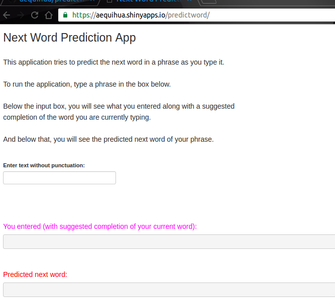
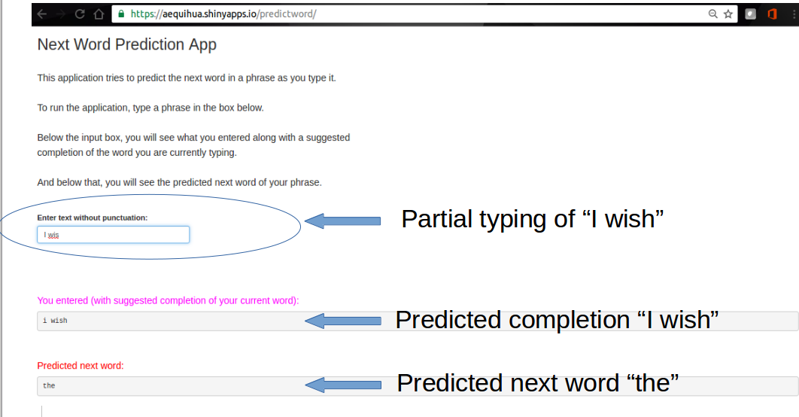

Word Prediction: Coursera Data Science Capstone Project
========================================================
author: Arturo Equihua
date: October 9th, 2016

Introduction
========================================================

<small>This presentation is about the Data Science Capstone project, by the John Hopkins University (JHU). The project objective is to allow us, as students, to apply the diverse data science skills required to capture, analyze, model and do predictions based on data from the real world, and pack this model into a Data Product that can be evaluated by potential employers. For this particular project, JHU partnered with SwiftKey 
(http://swiftkey.com/en/) to apply data science in the area of **natural language processing**.

The objective of this project was to build a working predictive text model. The data used in the model came from a **corpus** called HC Corpora (www.corpora.heliohost.org). A corpus is body of text, usually containing a large number of sentences. [1]

<small>[1] http://desilinguist.org/pdf/crossroads.pdf</small></small>

Algorithm Development
========================================================

<small>The algorithm developed to predict the next word in a user-entered text string was based on a classic **N-gram** model. [2] Using a subset of cleaned data from blogs, twitter, and news Internet files, **Maximum Likelihood Estimation** (MLE) of unigrams, bigrams, and trigrams were computed.

To improve accuracy, **Jelinek-Mercer smoothing** was used in the algorithm, combining trigram, bigram, and unigram probabilities. [3] Where interpolation failed, **part-of-speech tagging** (POST) was employed to provide default predictions by part of speech. [4] Suggested word completion was based on the unigrams. A profanity filter was also utilized on all output using Google's bad words list. [5]

<small>[2] http://en.wikipedia.org/wiki/N-gram</small>
<small>[3] http://www.ee.columbia.edu/~stanchen/papers/h015l.final.pdf</small>
<small>[4] http://en.wikipedia.org/wiki/Part-of-speech_tagging</small>
<small>[5] https://badwordslist.googlecode.com/files/badwords.txt</small></small>

The Shiny Application
========================================================

<small>Using the algorithm, a Shiny (http://shiny.rstudio.com/) application was developed that accepts a phrase as input, suggests word completion from the unigrams, and predicts the most likely next word based on the linear interpolation of trigrams, bigrams, and unigrams. The web-based application can be found <a href="https://aequihua.shinyapps.io/predictword/"> in this link</a>. The source files for this application, the data creation, and this presentation can be found <a href="https://github.com/aequihua/predictword"> here</a>. 
Below is an image of what the user interface looks like.</small>

Using the Application
========================================================

<small>Use of the application is straightforward and can be easily adapted to many educational and 
commercial uses. As depicted below, the user begins just by typing some text without punctuation in 
the supplied input box. As the user types, the text is echoed in the 
field below along with a suggested word completion. At the bottom of the screen, the 
predicted next word in the phrase is shown.</small>

